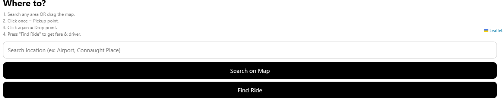

# 🚖 YatraCalci – Map-Based Fare Estimator  

A modern, animated, map-driven cab fare estimator built using **HTML, CSS, JavaScript, and Leaflet Maps**.  
This project calculates real-world distance, draws routes, estimates cab fare, assigns drivers,  
and shows a premium animated UI with colourful cars, glowing header, moving road, and more.

---
## 📸 Screenshots  

### 🏁 Header Preview  


### 🗺️ Map Screen Preview  


### 🎛️ Bottom Panel Preview  

---

## 🚀 Live Demo  
🔗 *(Add link after enabling GitHub Pages)*  
`https://yug1505-coder.github.io/YatraCalci/`

---

## 🌟 Features

### 🗺️ Map Features
- Click to set **Pickup** point  
- Click again to set **Drop** point  
- Automatic **route line**  
- Real-world **distance calculation (Haversine Formula)**  
- Search any place using **OpenStreetMap API**

### 💸 Fare Calculation
- Base fare + per km charge  
- GST-like 5% tax  
- Clean & modern UI  
- Demo driver assignment

### 🎨 Animated Header (Premium UI)
- Glowing black header  
- Moving road animation  
- 4 colourful cars running  
- Traffic light blinking  
- Money 💸 & Calculator 🧮 pulsing animations  
- Fully responsive mobile-friendly design

---

## 🧠 Tech Stack

| Component | Technology |
|----------|------------|
| Map Rendering | Leaflet.js |
| Geocoding | Nominatim OSM API |
| UI | HTML + CSS |
| Animations | CSS Keyframes |
| Logic | Vanilla JavaScript |
| Hosting | GitHub Pages |

---

## 📁 Folder Structure
```
YatraCalci/
├── index.html
├── style.css
├── app.js
└── README.md
```
---

## 🔧 Installation & Run Locally

### 1️⃣ Clone or Download
git clone https://github.com/yug1505-coder/YatraCalci.git


### 2️⃣ Open the Project
- Open folder in VS Code  
- OR just double-click `index.html`

### 3️⃣ Optional (Using Live Server)
Right-click → **Open with Live Server**  
(This gives auto-refresh & easy testing)

---

## 🧩 How It Works

### ▶ Step 1 — Pickup & Drop
- 1st map click → Pickup  
- 2nd click → Drop  
- 3rd click → Reset and set new pickup

### ▶ Step 2 — Distance Calculation
- Uses **Haversine Formula**  
- Accurate real-world distance in kilometers

### ▶ Step 3 — Route Draw
- Leaflet polyline draws a clean route line  
- Pickup → Drop

### ▶ Step 4 — Fare Calculation
Fare = Base Fare + (Distance × Price per km) + 5% GST


### ▶ Step 5 — Driver Assignment
- A random demo driver is displayed with rating

---

## 📸 Screenshots  
*(Add your real screenshots later)*

---

## 🔒 License  
MIT License recommended.  
Feel free to use or modify with credit.

---

## 👨‍💻 Author  
**Yug Babbar**  
B.Tech CSE (2nd Year)  
Full-Stack + AI Learner  
GitHub: https://github.com/yug1505-coder  

---

## 📝 Recruiter Notes
This project demonstrates:
- JavaScript logic  
- API usage  
- UI/UX animation skills  
- Real-time map rendering  
- Frontend problem solving  
- Clean file structure  

---


